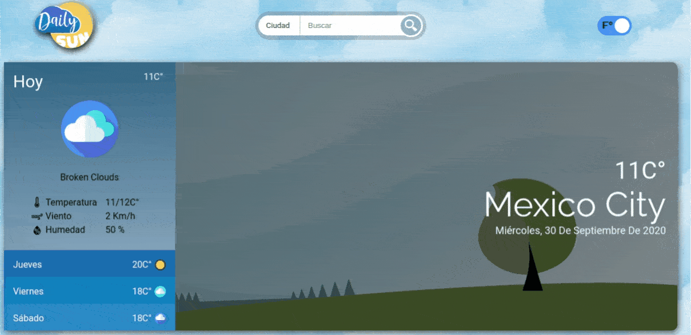

# DailySun

Dailysun is a weather portal focused in accesibility.

**Site:** [dailysun.vercel.app](https://dailysun.vercel.app/)

# ☄Getting Started

To run this project locally:

**Linux & npm**

Clone this repo `$ git clone https://github.com/devacran/Dailysun.git`

Frontend

1. Enter to the folder `$ cd ./Dailysun/FrontendDailySun`
2. Install dependencies `$ npm i`
3. Run development enviroment`$ npm run start:dev`

API

1. Enter to the folder `$ cd ./Dailysun/DailySuunAPI`
2. Install dependencies `$ npm i`
3. Run the server `$ npm run start:dev`

# 🐬Deployment

This project has deployed with Vercel

# 📰 License

The MIT Licence (MIT)

# 👨‍🍳Contributing

If you want to contribute with this project, just make a Pull Request explaining the improving.

# 🖥 Technologies

Frontend

- Javascript
- Pug JS
- Sass
- Chart JS
- Webpack
- Babel

Backend

- Express
- Node JS
